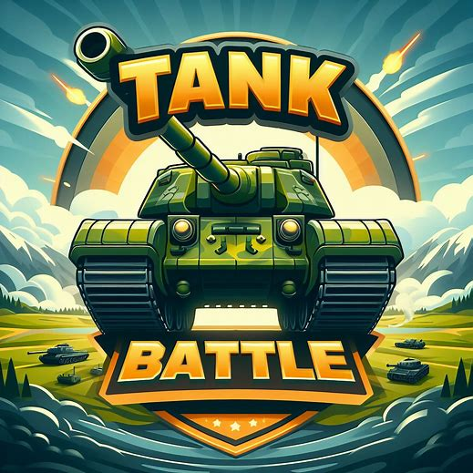

# NAME OF YOUR PROYECT

## [Play the Game!](https://pablosanchezcamara.github.io/tanks-battle/)

# Description

Tank Battle es un juego en el que el jugador tiene que destruir tanques enemigos mientras intenta esquivarlos para no perder su vida. Estos enemigos salen de manera aleatoria por cualquier lado de la pantalla e irán aumentando su velocidad de movimiento según pasa el tiempo. El jugador también tendrá un bonus con el que podrá ir aumentando su velocidad.

# Main Functionalities

- El jugador se mueve en todas las direcciones utilizando las flechas de dirección.
- Clickando la barra espaciadora el jugador dispara en la dirección a la que está mirando.
- Los enemigos aparecen de dos en dos manera aleatoria por cualquier lado de la pantalla cada tres segundos.
- Los enemigos aumentan su velocidad con el paso del tiempo.
- El jugador aumenta su velocidad si coge los bonus.
- Los bonus aparecen de manera aleatoria dentro de la pantalla de juego cada cierto tiempo.
- La puntuación final se calcula con la suma de todos los enemigos destruidos.

# Backlog Functionalities

- List here all functionalities you wish to add to your proyect later.

# Technologies used

- HTML
- CSS
- JavaScript
- DOM
- JS CLasses
- JS Audio
- JS Imagen

# States

- Start Screen
- Game Container Screen
- Game Over Screen

# Proyect Structure

## main.js

- startGame ()
- restartGame()
- handleKeyDown(event)
- handleKeyUp(event)

## Game.js

- Game () {
    - this.tanque;
    - this.height;
    - this.width;
    - this.kills;
    - this.lives;
    - this.gameIsOver;
    - this.gameIntervalId;
    - this.gameIntervalFreq;
    - this.enemies;
    - this.enemiesAppearFreq;
    - this.enemySpeed;
    - this.enemiesSpeedTimeIncrease;
    - this.enemyAppearIntervalId;
    - this.disparos
    - this.disparoSound;
    - this.disparoSound.volume;
    - this.bonusAppearIntervalId;
    - this.bonusAppearFreq;
    - this.bonusArr;
}
- enemySpeedIncrease()
- start()
- gameLoop()
- bonusAppear()
- enemiesAppear()
- update()
- createNewShoot ()
- updateCounter()
- addKillToCounter()
- endGame()

## Tanque.js 

- Tanque () {
    - this.gameBoxNode;
    - this.left;
    - this.top;
    - this.width;
    - this.height;
    - this.directionX;
    - this.directionY;
    - this.enfoque;
    - this.speed;
    - this.elementTank;
}
- move()
- updatePosition()
- didCollide(enemy)
- didCollideBonus(bonus)

## Enemy.js

- Enemy () {
    - this.gamebBoxNode;
    - this.type;
    - this.elementEnemy;
    - this.speed;
}
- updatePosition()
- move()

## Disparos.js

- Diparos (){
    - this.speed;
    - this.w;
    - this.h;
    - this.type;
    - this.elementShoot;
}
- updatePosition()
- move()
- didCollide(enemy)

## Bonus.js

- Bonus (){
    - this.gameBoxNode;
    - this.x;
    - this.y;
    - this.w;
    - this.h;
    - this.elementBonus;
}

# Extra Links 

### Sketch
[Link](https://excalidraw.com/#json=uFI5J_mETE3IR-71_SZUh,AXA682D03qFtHk6pHQjt1w)

### Slides
[Link](www.your-slides-url-here.com)

## Deploy
[Link](https://pablosanchezcamara.github.io/tanks-battle/)